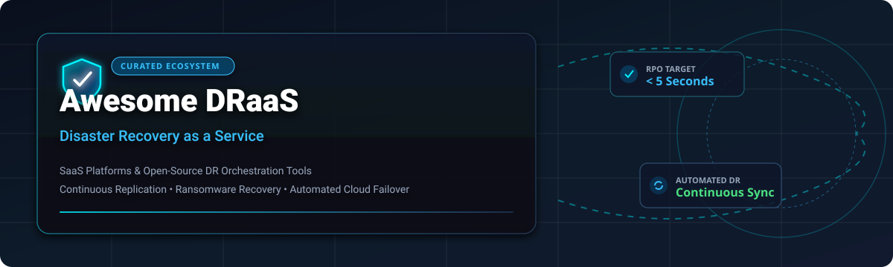

  

# Awesome Disaster Recovery as a Service (DRaaS) 🛡️ 🚀

> ⚡ A curated list of **Disaster Recovery as a Service (DRaaS)** platforms, enterprise recovery orchestration tools, continuous replication solutions, and open-source backup software for ransomware recovery, multi-cloud failover, and business continuity planning. 🛡️

*📅 Updated: October 2026*

---

## 📌 Overview & Introduction 💡

**Disaster Recovery as a Service (DRaaS)** enables organizations to replicate physical, virtual, and cloud workloads to secondary cloud or on-premises targets, providing automated failover, near-zero **RPO (Recovery Point Objective)**, and minimal **RTO (Recovery Time Objective)** during regional outages, hardware failures, or ransomware attacks. 🔐

This repository tracks top-tier **commercial SaaS DRaaS platforms** ☁️ and production-capable **open-source GitHub projects** 🔓.

---

## 📖 Table of Contents 📑

- [☁️ Top SaaS & Enterprise DRaaS Platforms](#-top-saas--enterprise-draas-platforms)
- [🔓 Open-Source Disaster Recovery & Backup Projects](#-open-source-disaster-recovery--backup-projects)
- [❓ Frequently Asked Questions (DRaaS FAQ)](#-frequently-asked-questions-draas-faq)
- [🤝 How to Contribute](#-how-to-contribute)
- [💖 Support & Sponsorship](#-support--sponsorship)
- [⚠️ Disclaimer & Market Context](#️-disclaimer--market-context)
- [📈 Star History](#-star-history)

---

## ☁️ Top SaaS & Enterprise DRaaS Platforms 🏢

> **📊 Market Context & Pricing**: The global DRaaS market is estimated at **~$15B in 2026**, growing toward **~$45B by 2032**. Hyperscalers like **Microsoft Azure Site Recovery** and **AWS Elastic Disaster Recovery (DRS)** dominate native cloud integration, while specialized enterprise engines like **Zerto (HPE)** and **Veeam** lead continuous data protection (CDP) and orchestration. **Pricing models vary**: per-VM subscription, protected instance fees, storage replication tiers, or flat-rate MSP models. 💰

| Platform | Description | Pricing (Starting Tier) | Free Tier Limits | Company Size |
|----------|-------------|------------------------|------------------|--------------|
| **[Azure Site Recovery](https://azure.microsoft.com/en-us/products/site-recovery/)** | **Microsoft's native DR orchestration.** Replicates Azure VMs, VMware, Hyper-V, and physical servers to Azure or secondary sites with automated runbooks. | **Protected Instance License fee** (per VM/physical server) + **replica storage** + **cache storage account** + **transactions** + **snapshots**. A2A replication incurs egress costs. | **None** — Azure free account gives $200 credit for 30 days. **No perpetual free tier** for Site Recovery. | **~$281B revenue (Microsoft FY2025)** |
| **[AWS Elastic Disaster Recovery](https://aws.amazon.com/disaster-recovery/)** | **AWS's continuous block-level replication service.** Replicates on-premises, cloud, or hybrid workloads to AWS with non-disruptive DR testing and point-in-time recovery. | **$0.028 per source server per hour** (~$20/month/server). Replication server EC2, EBS volumes, and EBS snapshots billed separately. **Only pay for recovery compute when you fail over or test**. | **AWS Free Tier**: $100–$200 credits for new accounts. **No perpetual free tier** for DRS. | **~$638B revenue (Amazon FY2025)** |
| **[Zerto (HPE)](https://www.zerto.com/)** | **Enterprise continuous data protection (CDP) with seconds RPO.** Application-consistent failover across VMware, Hyper-V, AWS, Azure, and Google Cloud with journal-based recovery points up to 30 days. | **Per-VM licensing** — perpetual (requires maintenance) or subscription. **Premium Maintenance**: **$166.56/month per VM** (CDW-G). **Starts at ~$745/year** based on deployment size. | **Free trial** available on request. **No perpetual free tier**. | **Part of HPE** |
| **[Veeam Data Platform](https://www.veeam.com/)** | **Comprehensive data protection and automated DR orchestration.** VDP Premium includes **Veeam Recovery Orchestrator** for automated DR failover testing, malware scans, and compliance reporting. | **VUL (Veeam Universal License)** subscription or perpetual. **VDP Premium** required for full DR orchestration. **Example DRaaS pricing**: **$110/month per TB** replication storage + **$70/month per VM** replication license. | **Veeam Community Edition**: Free for up to **10 VMs** (no automation/orchestration). | **~$2.0B backup revenue** |
| **[Datto Continuity](https://www.datto.com/)** | **Flat-fee DRaaS for MSPs and SMBs.** SIRIS DRaaS utilizes the immutable Datto Cloud with no extra compute, egress, or DR-testing fees. | **Flat fee based on client data retention** (1 year or infinite). **No hidden costs** for data stored, compute performance, DR testing, or cloud egress. | **None** — MSP-based pricing. **No direct free tier**. | **Part of Kaseya** |
| **[Druva Phoenix](https://www.druva.com/)** | **Cloud-native backup and DR for enterprise workloads, VMs, and SaaS.** Air-gapped immutable backups and automated cloud failover in AWS. | **Custom enterprise pricing** — quote required based on protected storage/instances. | **None** — enterprise demo required. | **Private (~$2B valuation est.)** |
| **[Acronis Cyber Disaster Recovery](https://www.acronis.com/)** | **Integrated cyber protection and cloud DR.** Combines backup, anti-ransomware protection, and instant cloud failover in a unified console. | **Custom enterprise pricing** — quote required. Offered via **Acronis Cyber Protect Cloud** for MSPs. | **30-day free trial** for Acronis Cyber Protect. | **Private (~$500M+ revenue est.)** |
| **[Carbonite Recover](https://www.carbonite.com/)** | **SMB-focused DRaaS with continuous push replication and cloud failover.** Part of OpenText Cybersecurity. | **Custom pricing** — quote required. | **Free trial** available on request. | **Part of OpenText** |
| **[Cohesity SiteContinuity](https://www.cohesity.com/)** | **Automated DR orchestration within Cohesity Data Cloud.** Disaster recovery runbook execution, non-disruptive testing, and unified backup failover. | **Custom enterprise pricing** — quote required. | **None** — enterprise demo required. | **Private (~$5B valuation est.)** |
| **[Quorum onQ](https://www.quorum.com/)** | **One-click DR hardware appliance and cloud failover.** Instant VM recovery and sandbox testing for ransomware defense. | **Custom pricing** — quote required. | **Free trial** available. | **Private (Quorum)** |

---

## 🔓 Open-Source Disaster Recovery & Backup Projects 🛠️

Open-source DR tools offer sovereign, cost-effective options for virtualized environments, self-hosted infrastructure, and Kubernetes clusters. 💻

| Project / Repo | Key Features & Architecture | Stars |
|----------------|-----------------------------|-------|
| **[DaliBackup-OSS](https://github.com/daliranas/DaliBackup-OSS)** | **Sovereign, lightweight backup & disaster recovery engine.** Supports **Microsoft Hyper-V** (VSS snapshots, continuous streaming GZip, instant DR), **Proxmox VE** (QEMU VM & LXC via REST API 2.0, native vzdump hook), and **IMAP** email sync. **Zero external database** (embedded SQLite), **AES-256-GCM encryption**, multi-protocol storage (POSIX/NFS, SFTP, FTP), and single Docker command setup. |  |
| **[Plakar](https://github.com/PlakarKorp/plakar)** | **Open standard for secure backup & recovery.** Features end-to-end encryption, client-side deduplication, and cross-platform binaries (Linux, Windows, macOS, BSD). Offers an enterprise **Plakar Control Plane** web interface for centralized management. |  |
| **[CloudRecovery](https://pypi.org/project/cloudrecovery/)** | **AI-assisted incident recovery & runbook automation.** Features read-only evidence triage, automated runbook execution with policy gates, command redaction, and local-first execution. Integrates with OpenAI, Claude, watsonx.ai, and Ollama. |  |
| **[Terraform Hybrid Cloud Failover](https://github.com/Ramirezr10/terraform-hybrid-cloud-failover)** | **Multi-cloud DR framework with Warm Standby architecture.** Orchestrates AWS (Primary) to GCP (Standby) failover using Terraform. Conditional `count` logic ensures zero compute cost until active DR failover is triggered. |  |

### 🛠️ Additional Open-Source Data Protection & K8s DR Tools 📦

- **[Velero](https://github.com/vmware-tanzu/velero)** — De facto open-source Kubernetes backup and DR migration tool for cluster state and persistent volumes. ☸️
- **[Kanister](https://github.com/kanisterio/kanister)** — CNCF sandbox project providing application-level data management and database disaster recovery blueprints on Kubernetes. 🗄️
- **[Stash](https://github.com/stashed/stash)** — GitOps-native Kubernetes backup operator by AppsCode for workload snapshotting and recovery. ⚙️
- **[BorgBackup](https://github.com/borgbackup/borg)** — Space-efficient, deduplicating backup tool with authenticated encryption and FUSE filesystem mounting. 🔒
- **[Restic](https://github.com/restic/restic)** — Fast, secure open-source backup program supporting local, S3, SFTP, and cloud backends. 🚀

---

## ❓ Frequently Asked Questions (DRaaS FAQ) 🤔

### What is Disaster Recovery as a Service (DRaaS)? ❓
Disaster Recovery as a Service (DRaaS) is a cloud computing service model that allows organizations to back up data and IT infrastructure to a cloud environment and orchestrate system failover during critical outages, cyberattacks, or disaster events.

### How does DRaaS differ from standard Cloud Backup? ⚖️
- **Cloud Backup** focuses on long-term data retention, cold storage, and restoring individual files or databases. Recovery time (RTO) can take hours or days.
- **DRaaS** focuses on operational continuity. It continuously replicates entire server states (OS, applications, memory state) to allow instant failover (RTO in minutes/seconds) with minimal data loss (RPO).

### What are RPO and RTO in Disaster Recovery? ⏱️
- **RPO (Recovery Point Objective)**: The maximum acceptable amount of data loss measured in time (e.g., 5 seconds of data lost).
- **RTO (Recovery Time Objective)**: The maximum acceptable duration of downtime before systems are fully online after failover.

### Can open-source tools replace enterprise DRaaS platforms? 🌐
Open-source solutions (e.g., **DaliBackup-OSS**, **Velero**, **Plakar**) excel at local virtualization, Hyper-V/Proxmox backups, and Kubernetes DR. However, hyper-scaler native automation (like **Azure Site Recovery** or **AWS DRS**) and continuous block-level journal recovery (like **Zerto**) typically require enterprise platforms for large hybrid multi-cloud setups.

---

## 🤝 How to Contribute 🌟

Contributions are welcome! Please follow these guidelines:

1. Fork this repository. 🍴
2. Add your tool to `README.md` under the appropriate section in alphabetical or logical order. 📝
3. Ensure all SaaS entries include **description**, **pricing**, **free tier limits**, and **company details**. 📊
4. Create a Pull Request with a summary of the additions. 🔀

---

## 💖 Support & Sponsorship 🙏

Thank you for exploring this curated list! If you find this repository helpful, please consider supporting the project:

- ⭐ **Star this repository** to show your appreciation and help others discover it.
- 🍴 **Fork and share** it with your fellow engineers, architects, and community.
- ☕ **Buy a Coffee / Sponsor**: Support ongoing maintenance and creation of awesome developer resources via the [GitHub Sponsor Dashboard](https://github.com/sponsors/ishandutta2007).

Your support is greatly appreciated! 🙌

---

## ⚠️ Disclaimer & Market Context 📢

- This repository is a community-curated list for informational and educational purposes.
- Verify all vendor SLA agreements, security compliance certifications, and pricing quotes directly with official vendor channels prior to deployment.
- Pricing metrics referenced above reflect verified public vendor data as of **October 2026**.

---

## 📈 Star History

---

**Maintained with ❤️ for Disaster Recovery Architects, Infrastructure Engineers, Site Reliability Engineers (SREs), and IT Operations Leaders.** 🚀
